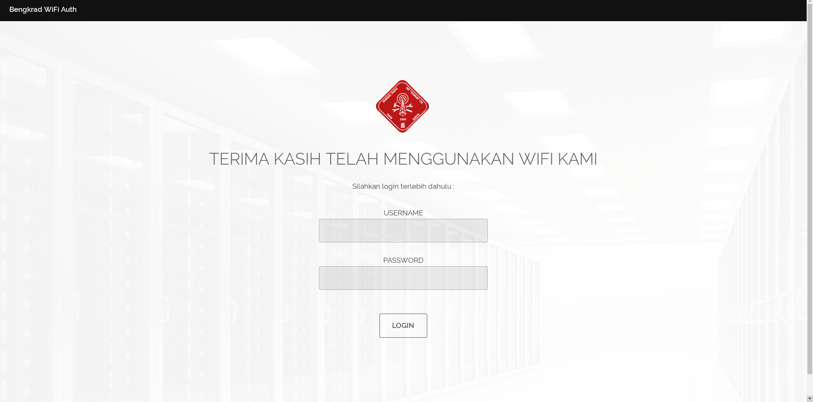

# Python Flask Captive Portal
Simple Captive Portal Server built in Python Flask using iptables rules for configurations. Some of the features are multi user account and multiple devices (limited to four).  

## Installation

